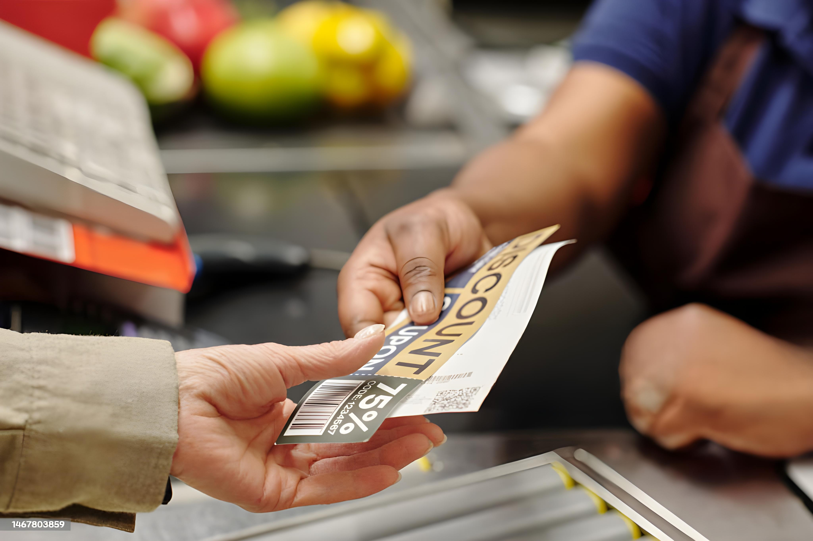
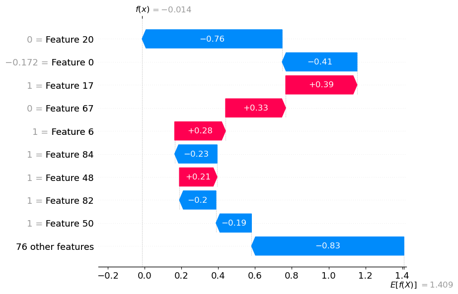

# 🎯 Coupon Acceptance Predictor

## Overview

The **Coupon Acceptance Predictor** project is a full-stack data science solution designed to **predict whether a customer will accept a coupon** based on their behavior, preferences, and profile. 

The project utilizes a machine learning pipeline and SHAP explainability to give both accurate predictions and transparent decision reasoning. The final model is deployed as a **Streamlit app hosted on Hugging Face Spaces**.

---

## Project Objective

- 🧠 **Binary Classification**: Predict whether a customer will **accept (`1`) or reject (`0`)** a given coupon.
- 📊 **Explainability**: Show feature-wise contribution to each prediction using **SHAP** waterfall plots.

This project aims to empower **retailers or marketers** to optimize coupon distribution strategies, increase acceptance rates, and better understand user behavior patterns.

---

## Dataset Features

The dataset includes various customer profile and contextual information:

- **Demographics & Profile**:
  - `age`, `gender`, `maritalStatus`, `education`, `income`, `has_children`
  
- **Behavioral Data**:
  - `CoffeeHouse`, `Bar`, `CarryAway`, `RestaurantLessThan20`, `Restaurant20To50`

- **Contextual Data**:
  - `destination`, `passanger`, `weather`, `temperature`, `expiration`, `toCoupon_GEQ5min`, `toCoupon_GEQ15min`, `toCoupon_GEQ25min`, `direction_same`, `direction_opp`

---

## Approach

1. **Data Preprocessing**  
   - Handling missing values  
   - Encoding categorical features with OneHotEncoder & OrdinalEncoder  
   - Scaling numerical values using StandardScaler  

2. **Model Training**  
   - Trained with `XGBoostClassifier`  
   - Tuned probability threshold to maximize recall for coupon acceptance  

3. **Model Evaluation**  
   - Metrics: Precision, Recall, F1-Score, Confusion Matrix  
   - Visual explanations using SHAP values  

4. **Deployment**  
   - Built Streamlit app interface  
   - Deployed on Hugging Face Spaces  

---

## 📊 Final Model Performance (Threshold = 0.45)

| Metric       | Class 0 (Reject) | Class 1 (Accept) |
|--------------|------------------|------------------|
| Precision    | 0.83             | 0.72             |
| Recall       | 0.54             | 0.91             |
| F1-Score     | 0.65             | 0.81             |
| Accuracy     | **75%**          |                  |

📌 **Confusion Matrix**:

```
\[\[ 588  507]
\[ 123 1319]]
```
---

---

## Key Insights

- 🔹 **High Recall for Acceptors (91%)**: Ideal for marketing teams to capture nearly all users likely to accept coupons.
- 🔹 **Some Overprediction on Rejection Class**: A deliberate trade-off to improve coupon targeting success.
- 🔹 **Top Features via SHAP**: 
  - `CoffeeHouse` and `destination` were among the strongest predictors for coupon acceptance.

---

## Business Implications

1. **Targeted Coupon Campaigns**  
   Improve coupon conversion rates by sending offers only to those with high predicted acceptance.

2. **Cost Optimization**  
   Avoid sending coupons to users with low likelihood of acceptance, reducing promotional costs.

3. **Behavioral Segmentation**  
   Analyze SHAP explanations to tailor marketing strategies based on behavioral traits (e.g., people who go to coffee houses are more likely to accept coupons).

---

## Model Explainability: SHAP

- ✅ Used **SHAP waterfall plots** to explain individual predictions
- ✅ Helps build trust with stakeholders by making the model interpretable

Example SHAP Plot:



---

## Deployment

🚀 **Live App**  
**🔗 [Hugging Face Spaces Link](https://huggingface.co/spaces/Sahil-S2/coupon-acceptance-predictor)**

🧪 Try out the model with your own inputs in the interactive Streamlit interface.

---

## Project Structure
```
coupon-acceptance-predictor/
│
├── src/
│   ├── streamlit\_app.py               # Streamlit frontend
│   ├── utils.py                       # Model loading, preprocessing, prediction, SHAP
│   ├── xgb\_coupon\_model.json          # Trained model
│   ├── xgb\_coupon\_preprocessor.skops  # Preprocessor (safe loading via skops)
│   └── threshold.txt                  # Custom threshold (0.45)
│
├── coupon\_acceptance\_notebook.ipynb   # Jupyter notebook with full EDA & training
├── requirements.txt
├── runtime.txt
└── README.md
```


---

## Technologies Used

- **Python**  
- **Pandas, NumPy**  
- **Scikit-learn, XGBoost**  
- **SHAP (Explainability)**  
- **Streamlit (App Deployment)**  
- **Hugging Face Spaces**  
- **Skops (secure loading of preprocessing pipeline)**  

---

## Conclusion

The Coupon Acceptance Predictor is a fully interpretable ML-powered tool that empowers businesses to:

- 🎯 Accurately target coupon campaigns  
- 💰 Reduce marketing waste  
- 💡 Make informed, explainable decisions

---

## 📎 Resources

- **Live Demo**: https://huggingface.co/spaces/Sahil-S2/coupon-acceptance-predictor  
- **GitHub Repo**: https://github.com/Sahil-S2/coupon-acceptance-predictor  
- **LinkedIn Post**: [See my LinkedIn update](www.linkedin.com/in/sahil-jena-067b1b301)

---

## 👤 Author

**Sahil Jena**  
📧 sahiljena.ds@gmail.com  
🔗 [LinkedIn](https://www.linkedin.com/in/sahiljena/) | 🐙 [GitHub](https://github.com/Sahil-S2)

---

## 📝 License

This project is licensed under the **MIT License**.
